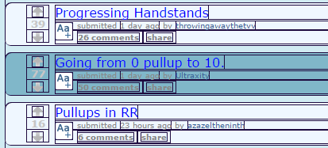
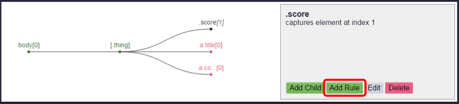
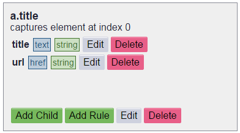

Tutorial
========

The following tutorial shows how to get a list of submissions from a subreddit of reddit.com. This is purely for demonstration since the `PRAW <https://praw.readthedocs.org/en/v3.1.0/>`_ Python library exists and is much more ideal for accessing data from reddit.

Start by clicking the Forager button to the right of the omnibox to open Forager.

When opening Forager, no pages will be selected.

Before You Get Started
^^^^^^^^^^^^^^^^^^^^^^

One thing to keep in mind is that the page that you're seeing isn't necessarily the webpage that `Gatherer <https://github.com/pshrmn/gatherer>`_ (the library used to gather data using the rules we are creating) will see. :code:`Gatherer` will be receiving the html of the site as a non-logged in user, as well as having no extensions modifying the page. When creating a Page you should log out and disable any extensions that are running (eg. Reddit Enhancement Suite) if you want to see what :code:`Gatherer` will.

Create Page
^^^^^^^^^^^^
The first step is to create a new page.

1. Click the :code:`Add` button
+++++++++++++++++++++++++++++++

.. image:: img/add-page.png

2. Choose the Page name
+++++++++++++++++++++++

In the prompt enter a legal page name and click ok. A legal page name can not include these characters:

    < > : " \ / | ? *

This is because they are not allowed in file names by Windows.

The name of the page for this tutorial will be "submissions". Once the name has been entered, click the :code:`OK` button.

You now have a new page, with a base selector on the body element.

.. image:: img/new-page.png

Forager's functionality is broken up into frames, where each frame has a unique purpose. The base frame is the element frame, which allows you to select elements from the tree and manipulate them by adding child elements, adding rules, editing the element, or removing it.

Elements
^^^^^^^^^^^^

Pages are made up of a tree of :code:`elements`. There are two types of elements:

1. Single Elements
+++++++++++++++++++

Single :code:`elements` match one specific child of a parent :code:`element`, specifically the one at a provided index. When gathering data, first, an array of all elements matched using the :code:`element`'s selector is found, then the one at the index is selected. Any rule data captured from single :code:`elements` will be merged into the data from its parent.

2. All Elements
++++++++++++++++

All :code:`elements` match all children of the parent elementor that are selected by the :code:`element`'s selector. When gathering data, an array will be returned with each item in the array being the data from the corresponding matched element's rules (and any of its children's rules).

Elements
++++++++

When a page is loaded or created, for each :code:`element` in the :code:`page`, an array of matches that match the :code:`element` is added to the :code:`elemenet`. This is useful for highlighting which DOM elements in the webpage are selected by an :code:`element`.

Add Children
^^^^^^^^^^^^
Now that you have added a :code:`page`, it is time to start adding child :code:`elements`.

Note: Sometimes an :code:`element` does not have any relevant data associated with it, but because of the layout of the webpage, it is required (or more convenient) to create it in order to more easily select a child :code:`element`.

Because we are getting a list of submissions, the first :code:`element` that we want to create is an :code:`All element` that matches all of the submission elements in the page.

1. Add child
++++++++++++

Before you add a child, make sure that the :code:`element` you want to use as the parent of the new :code:`element` is the current :code:`element`. By default, the root "body" :code:`element` is selected when creating or loading a page. When you save a new :code:`element`, it is set as the current :code:`element`. Clicking on a node in the tree will make that node the current :code:`element`. When you have the desired :code:`element` selected, click the :code:`Add Child` button. This will take you to the add element frame, which includes a wizard for creating a new :code:`element`. At any point, you can click the :code:`Cancel` button and you will return to the element frame.

.. image:: img/add-child.png

All DOM elements in the page that can be selected will have an outline and when hovered over will have a light blue background. Image elements that can be selected will have a dashed outline and hovering over them will set the image's opacity to :code:`0.25`.

2. Select Element in the Page
+++++++++++++++++++++++++++++

Click on any outlined DOM elements in the webpage. Clicking on an element will generate a list of element css selectors to choose from, starting with the element you clicked and including all of its parent elements (up to, but not including, the nearest parent element in the current selector's elements array). Each selector is a string of an element's tag, its id (if it has one) and any classes that it has. Which of these parts of the selector we actually want to use will be determined in the next step. A wildcard css selector, :code:`*`, is also provided in case you want to select all children. Also, when you create an :code:`element` that matches :code:`select` elements, an :code:`option` css selector will be provided (because you cannot select this yourself).

.. image:: img/element-choices.png

Example:

.. code-block:: html

    <body>
        

            

                <a href="#">Link</a>
            

        

    </body>

If the current :code:`element`'s css selector is :code:`body`, clicking on the :code:`a` element will return the :code:`a`, :code:`p`, and :code:`div#main` css selectors.

3. Choose Element
+++++++++++++++++

Click on the elements in the list to see which elements in the page each one would select.

.. image:: img/highlight-element.png

The chosen css selector does not highlight all of the submissions that we want to capture because it is too specific. In the next form, we will choose the css selector parts to match all of the desired elements in the page.

When you have the selector that matches the desired element(s), click the :code:`Next` button.

4. Choose the Selector Parts
++++++++++++++++++++++++++++

By default, all possible parts of the css selector are activated. Click on the various selector parts in the list to toggle whether or not they are included (green is included, white is not) in the final selector. The page will update the highlighted elements to reflect the current final selector.

.. image:: img/narrow-selector.png

Once you have chosen the desired selector parts, click the :code:`Next` button.

5. Choose which Element Type
++++++++++++++++++++++++++++

Once you have chosen the selector for the new :code:`element`, you need to choose which type of :code:`element` this is. By default, :code:`single` is selected since most :code:`elements` will be :code:`single elements`. However, for this :code:`element`, since we want to select all submissions in the page, we will be creating an :code:`all element`. Toggling between the types will highlight which elements will be selected by either type. However, in the case of :code:`single elements`, only the first DOM element will be selected since the default :code:`index` for :code:`single elements` is :code:`0`.

Once the desired type is set, click the :code:`Next` button.

6. Choose the Element's Value
++++++++++++++++++++++++++++

Because this is an :code:`all element`, we will have to set a name for the array of data that will be created from the matching elements. Since we are matching the submissions in the page, :code:`submissions` is an obvious choice for a name.

If we had instead created a :code:`single element`, we would instead need to choose the appropriate index value for the :code:`element`.

Once the desired value is set, click the :code:`Next` button.

7. Specify if the Element is Optional
+++++++++++++++++++++++++++++++++++++

Most of the time, the reason that we are creating an :code:`element` is because we want to get some sort of data from it. Occasionally, an element will have data that we want, but a corresponding DOM element will not exist. When gathering data, if an :code:`element` does not have a matching DOM element, the corresponding data object will be omitted. If we don't want this to happen, we can mark an :code:`element` as optional, and its data will just be skipped.

Here, it would not make sense for the :code:`submissions` :code:`element` to be optional because it is the base of our data and without it there are no other :code:`elements` to match, so we will leave it unchecked.

Once the desired optional value is set, click the :code:`Next` button.

8. Verify the Element and Save
++++++++++++++++++++++++++++++

The last step in the wizard is to verify all of the values that you have selected. If you notice that anything is incorrect, you can use the :code:`Previous` buttons to step backwards through the wizard. Otherwise, assuming everything is correct, click the :code:`Save` button. This will save the :code:`element` and return you to the element frame, where your newly created :code:`element` will be selected.

9. Back at the Element Frame
+++++++++++++++++++++++++++++++++++++++++++

The page tree will now be updated to include a node for the newly created :code:`element`. The :code:`element`'s :code:`selector` is used to identify the :code:`element` node. The node for the :code:`element` is bolded because it is the currently selected one. It also has brackets around the selector to indicate that it will capture all elements and is in red because it is empty (ie. it has neither any child elements nor any attributes).

.. image:: img/updated-page.png

All of the DOM elements that match the current :code:`element` will have a blue background.

10. Capture children elements
++++++++++++++++++++++++++++

Now that we have the :code:`element` to match each submission, we want to create child :code:`elements` that have the data we would like to gather. If it is not the currect element, click on the :code:`[.thing]` node in the tree to make sure that it the current :code:`element`, then click on the :code:`Add Child` button once again. Now only child DOM elements of the current :code:`element` will be outlined in the page.

There are various datum that can be captured from here. Using the steps above, you should now create new :code:`elements` to get the submission's title, its url, how many points it has, and a link to its comments. Remember that when saving a selector, it is set as the current selector, so you will have to click back on the previous parent node when you want to add multiple children to it.

Now, all of the desired selectors are created, but some of the nodes are still in red. That is because we still need to create Rules for them.

Create Rules
^^^^^^^^^^^^

Rules specify what data we want to get from a DOM element. These will either be attributes of the element or the element's text content. Each rule will need a (unique) name and a type (string, int, or float). The type defaults to string and that should be used in most cases. The int and float options are useful for extracting numeric data, but may be too basic for many cases.

1. Create a Rule
++++++++++++++++

Here we'll get the current score of the submission. Click on the node in the tree for the score (for me it is :code:`.score[1]]`) to make it the current :code:`element`, then click the :code:`Add Rule` button. This will open the rule wizard which will step you through creating a new rule.

2. Choose the Attribute
+++++++++++++++++++++++

The first step in creating a rule is selecting the proper attribute. The :code:`element` will still be shown in the frame so that you can see which rules you have already created. Select the radio element of the attribute that you want to create a rule for. The value of the attribute will be listed below the radio. You may want (or need) to cycle through various elements using the arrow buttons in order to see the attribute values for the different matched DOM eleements.

Once you have selected the desired attribute, click the :code:`Next` button.

3. Choose the type
++++++++++++++++++

A rule can specify that the captured value should be either a string, an int, or a float. Int and float types should only be used when you know that the captured value will contain an int or a float. If the type is int or float, and no int or float is found when using :code:`Gatherer` to collect that data, :code:`None` will be returned. Here we are getting the score of a submission, which we expect to be an int, so choose the type :code:`int`.

Once you have selected the desired type, click the :code:`Next` button.

4. Choose the Name
+++++++++++++++++++

Give the rule a name. The name should be a simple description of what the value this rule is capturing is. Here we are getting the score of a submission, so the rule should be named :code:`score`.

5. Verify the Rule and Save
++++++++++++++++++++++++++++

Verify that all of the properties of the rule are correct. You can use the :code:`Previous` button to go back and make any changes. Once everything is set as you desired, click the :code:`Save` button. This will create the rule and return you to the element frame.

You can create multiple Rules for a selector. This is commonly used for selectors that match :code:`<a>` elements where you want both the :code:`text` of the anchor as well as the :code:`href`

Preview
^^^^^^^

At any point in time, you can preview what the data collected by the page will be by clicking the :code:`Preview` button. For simple data collection, you probably won't even need to use gatherer, but instead just copy and paste the preview data. The preview frame also has buttons for logging the data to the developer console. Clicking the :code:`Hide Preview` button will return you to the element frame.

Upload
^^^^^^

Once you have created rules for all of the selectors, it is time to upload the page.

.. image:: img/completed-page.png

In order to upload, you need to have `Granary <https://github.com/pshrmn/granary>`_ running. In the directory where you want the page uploaded to, start up the :code:`Granary` server.

.. code-block:: python

    python -m granary.server

Uploading is as simple as clicking the :code:`Upload` button.

.. image:: img/upload.png

As long as the :code:`Granary` server is running, the page should be saved as a json file in the :code:`rules/<domain>` folder where the server is running (unless you specify a different location). (:code:`domain` is the hostname of the website the page is created for, except with periods :code:`.` replaced by underscores :code:`_`)

Once you have a page uploaded, it is time to use `Gatherer <https://github.com/pshrmn/gatherer>`_ to collect the data.
