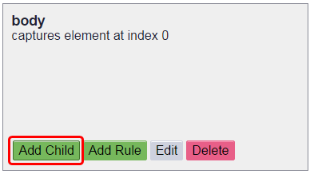
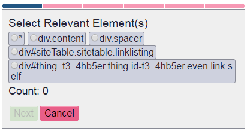
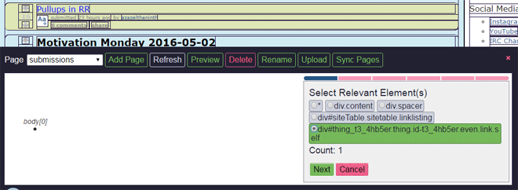
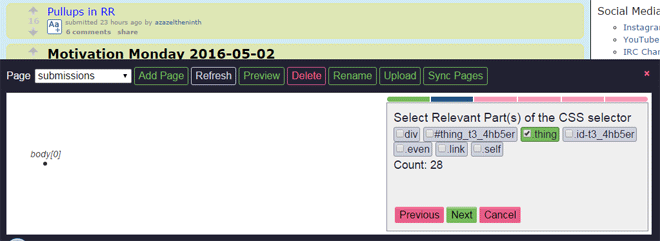
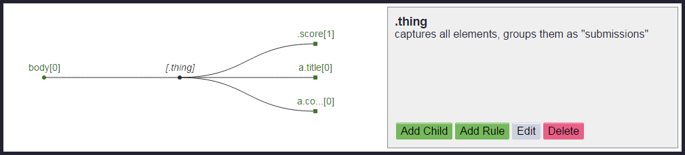
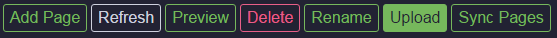

Tutorial
========

The following tutorial shows how to get a list of submissions on a subreddit homepage on reddit.com. This is purely for demonstration since the `PRAW <https://praw.readthedocs.org/en/v3.1.0/>`_ Python library exists and is much more ideal for accessing data from reddit.

Click the Forager button to the right of the omnibox to open Forager

.. image:: img/open.png

When opening Forager, you will get an empty interface.

Before You Get Started
^^^^^^^^^^^^^^^^^^^^^^

One thing to keep in mind is that the page that you're seeing isn't necessarily the page that `Gatherer <https://github.com/psherman/gatherer>`_ (the library used to gather data using the rules we are creating) will see. :code:`Gatherer` will be receiving the html of the site as a non-logged in user, as well as having no extensions modifying the page. You should log out and disable any extensions that are running (eg. Reddit Enhancement Suite) if you want to see what :code:`Gatherer` will.

Create Page
^^^^^^^^^^^^
The first step is to create a new page.

1. Click the :code:`Add` button
+++++++++++++++++++++++++++++++

.. image:: img/add-page.png

2. Choose the Page name
+++++++++++++++++++++++

In the prompt enter a legal page name and click ok. A legal page name does not include these characters:

    < > : " \ / | ? *

The name of the page for this tutorial will be "submissions". Once the name has been entered, click the :code:`OK` button.

.. image:: img/page-name.png

You now have a new page, with a base selector on the body element.

The left box contains controls for the current page and the right box contains controls for the current selector.

Selectors
^^^^^^^^^^^^

Pages are made up of a tree of :code:`selectors`. There are two types of selectors:

1. Single selectors
+++++++++++++++++++

These target one specific child element of a parent element which matches the selector. An index integer is stored for single selectors to indicate which child to select when multiple elements match the selector.

2. All selectors
++++++++++++++++

These target all child elements of the parent element that match the selector. A name string is stored for all selectors to indicate the name of the array to store the children's data in.

Elements
++++++++

When a page is loaded or created, for each selector in the page, an array of elements that match the selector is added to the selector object. This is useful for highlight which elements in the page match a selector as well as figuring out matching elements for an child selectors.

Add Children
^^^^^^^^^^^^
Now that you have a page, it is time to start adding child selectors.

Note: Sometimes a selector does not have any relevant data associated with it, but because of the layout of the page, is required (or more convenient) to more easily target a child selector.

Because we are getting a list of submissions, the first selector we want to create is an :code:`All` selector that targets all of the submission elements.

1. Add child
++++++++++++

Before you add a child, make sure that the selector you want to use as the parent of the new selector is the current selector. By default, the root "body" selector is selected when creating or loading a page and when you save a new selector, it is set as the current selector. Clicking on a node in the tree will make that node the current selector. When you have the desired selector selected, click the :code:`Add Child` button

All elements in the page that can be selected will have an outline and when hovered over will have a light blue background. Images that can be selected will have a dashed outline and hovering over them will set the image's opacity to :code:`0.25`.

.. image:: img/highlight-children.png

2. Select Element in the Page
+++++++++++++++++++++++++++++

Click on any outlined elements in the page. Clicking on an element will generate a list of element css selectors, starting with the element you clicked and including all of its parent elements (up to, but not including, the nearest parent element in the current selector's elements array). Each selector is a string of an element's tag, its id (if it has one) and any classes that it has. Which of these parts of the selector we actually want to use will be determined in the next step.

Example:

.. code-block:: html

    <body>
        

            

                <a href="#">Link</a>
            

        

    </body>

If the current css selector is :code:`body`, clicking on the :code:`a` element will return the :code:`a`, :code:`p`, and :code:`div#main` css selectors.

3. Choose Element
+++++++++++++++++

Click on the elements in the list to see which elements in the page that each one would select.

The chosen selector does not highlight all of the submissions that we want to capture because it is too specific. In the next form, we will choose the selector parts to match all of the desired elements in the page.

When you have the selector that matches the desired element(s), click the :code:`Next` button.

4. Choose the Selector Parts
++++++++++++++++++++++++++++

By default, all possible parts of the css selector are activated. Click on the various selector parts in the list to toggle whether or not they are included (green is included, white is not) in the final selector. The page will update the highlighted elements to reflect the current final selector.

Once you have chosen the desired selector parts, click the :code:`Next` button.

5. Set the name for the selection
+++++++++++++++++++++++++++++++++

On the next page, we will choose which type of selector we are creating. There are radio options for selecting either "single" or "all". The default selector is "all".

For a :code:`single` selector, you need to specify an index.

.. image:: img/save-single.png

For an :code:`all` selector, you need to specify a name. Ideally the name should be plural (since we're selecting multiple elements).

.. image:: img/save-all.png

Because we are targeting all of the submissions in the page, we will use the "all" radio option, and set a name for all of the data for the each element and its children to be stored under. Once the name has been entered, click the :code:`Save` button.

6. The UI will return to the Selector Frame
+++++++++++++++++++++++++++++++++++++++++++

The page tree will be updated now to include the newly selected node. The updated node is bolded because it is the current selector.  It also has brackets around the selector to indicate that it will capture multiple elements and is in red because it is empty (ie. it has neither any child elements nor any attributes).

.. image:: img/updated-page.png

All of the elements that match the current selector will have a blue background.

7. Capture children elements
++++++++++++++++++++++++++++

Now that we have the selector to get each submission, we want to get child elements that have the data we would like to collect. Click on the :code:`[div.t....link]` (this is really the div.thing.link node, but long selector names are shortened) node in the tree to make sure that it is the current selector, then click on the :code:`add child` button once again. Now only child elements of the current selector will be outlined in the page.

There are various datum that can be captured from here, such as the submitted title, the submitted url, how many points it has, and a link to the submission's comments.

8. Save index of elements
+++++++++++++++++++++++++

For selectors where only one element should be targeted, an index is used in case the selector matches multiple elements (per parent element). By default, the 0-index element is selected and generally that will be the correct index. However for some sources you'll want to target a different index. For example, if you want to select the second :code:`td` of a :code:`tr` in a :code:`table`. Changing the index will update the highlights showing which matched element will be selected.

.. image:: img/non-zero-index.png

9. Completed selector tree
++++++++++++++++++++++++++

You can now iterate over the tree and create all of the selectors for desired information. Remember that when saving a selector, it is set as the current selector, so you will have to click back on the previous parent node when you want to add multiple children to it.

Go ahead and create child selectors to get the title of the submission, the score of the submission, and the link to the submission's comments.

.. image:: img/completed-selectors.png

Now, all of the desired selectors are created, but some of the nodes are still in red. That is because we still need to create Rules for them.

Create Rules
^^^^^^^^^^^^

1. Create a Rule
++++++++++++++++

Here we'll get the current score of the submission. Click on the node in the tree for the score (for me it is :code:`div.title[0]`) to make it the current selector, then click the :code:`Add Rule` button. 

.. image:: img/add-rule.png

2. Choose the name
++++++++++++++++++

Give the rule a name. The name should be a simple description of what the value this rule is capturing is. Here we are getting the score of a submission, so the rule should be named :code:`score`.

3. Choose the type
++++++++++++++++++

A rule can specify that the captured value should be either a string, an int, or a float. Int and float types should only be used when you know that the captured value will contain an int or a float. If the type is int or float, and no int or float is found when using :code:`Gatherer` to collect that data, -1 will be returned. Here we are getting the score of a submission, which we expect to be an int, so choose the type :code:`int`.

4. Choose the attribute
+++++++++++++++++++++++

Click on the desired attribute in the list of attributes to select which attribute (or the text content) to collect. The left column is the html attribute (or text) that you will capture, and the right column is the value of that attribute for the current element in the page. You can click the :code:`<<` and :code:`>>` buttons at the bottom of the form to cycle through all of the elements that are captured by the current selector.

We want to get the text of the div.

5. Save the Rule
++++++++++++++++

Once the name is set, the type is chosen, and the attribute is seletced, click on the :code:`Save` button.

.. image:: img/choose-rule.png

You can create multiple Rules for a selector. This is commonly used for selectors that match :code:`<a>` elements where you want both the :code:`text` of the anchor as well as the :code:`href`

.. image:: img/multiple-rules.png

Upload
^^^^^^

Once you have created rules for all of the selectors, it is time to upload the page.

In order to upload, you need to have `Granary <https://github.com/psherman/granary>`_ running. Make sure to call the following code in the desired directory to run the granary server.

.. code-block:: python

    python -m granary.server

Uploading is as simple as clicking the :code:`upload` button.

As long as the granary is running, the page should be saved as a json file in the :code:`rules/<domain>` folder where the server is running (unless you specify a different location). (:code:`domain` is the hostname of the website the page is created for, except with periods :code:`.` replaced by underscores :code:`_`)

Once you have a page uploaded, it is time to use `Gatherer <https://github.com/psherman/gatherer>`_ to collect the data.
