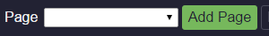
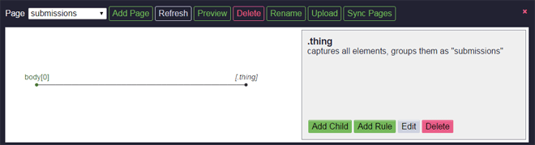

Tutorial
========

The following tutorial shows how to get a list of submissions on a subreddit homepage on reddit.com.

Click the Forager button to the right of the omnibox to open Forager

.. image:: img/open.png

When opening Forager, you will get an empty interface.

Create Page
^^^^^^^^^^^^
The first step is to create a new page.

1. Click the :code:`Add` button

2. In the prompt enter a legal page name and click ok. A legal page name does not include these characters:

    < > : " \ / | ? *

The name of the page for this tutorial will be "submissions"

.. image:: img/page-name.png

3. You now have a new page, with a base selector on the body element.

.. image:: img/new-page.png

Selectors
^^^^^^^^^^^^

There are two types of selectors:

1. Single selectors 

These target one specific child element of a parent element which matches the selector. An index integer is stored for single selectors to indicate which child to select when multiple elements match the selector.

2. All selectors

These target all child elements of the parent element that match the selector. A name string is stored for all selectors to indicate the name of the array to store the children's data in.

Add Children
^^^^^^^^^^^^
Now that you have a page, it is time to start adding child selectors.

Note: Sometimes a selector does not have any relevant data associated with it, but because of the layout of the page, is required (or more convenient) to more easily target a child selector.

Because we are getting a list of submissions, the first selector we want to create is an :code:`All` selector that targets all of the submission elements.

1. Add child

Make sure that the desired parent element is the current element. By default the last created selector is the current parent selector. Clicking on a node in the tree will make that node's selector the current selector. When you have the desired parent set, click the :code:`Add Child` button

.. image:: img/add-child.png

All elements in the page that can be selected will have an outline. Images that can be selected will have a dashed outline. Mousing over the element will give the element an blue background. Mousing over images will give them an :code:`0.25 opacity`.

.. image:: img/highlight-children.png

2. Click on any outlined elements in the page

Clicking on an element will add a list of element selectors, from the clicked element to all parent elements before the current selector. 

.. image:: img/element-choices.png

Example:

.. code-block:: html

    <body>
        

            

                <a href="#">Link</a>
            

        

    </body>

If the current selector is :code:`body`, clicking on the :code:`a` element will return the :code:`a`, :code:`p`, and :code:`div#main` selectors.

3. Click on the elements in the list to see which elements in the page that each one would select.

.. image:: img/highlight-element.png

The chosen selector does not select all submissions that we want because it is too specific. We will get rid of the unwanted selector parts in the next form.

When you have the selector that matches the desired element(s), click the :code:`Confirm` button.

4. Confirm the selector

By default, all parts of the selector are activated. Click on the various selector parts in the list to toggle whether or not they are included (green is included, red is not) in the final selector. The page will update the highlighted elements to reflect the current final selector.

.. image:: img/narrow-selector.png

Once you have the desired selector, click the :code:`Confirm` button.

5. Set the name for the selection

On the next page, we will choose which type of selector we are creating. There are radio options for selecting either "single" or "all". The default selector is "all".

For a :code:`single` selector, you need to specify an index.

.. image:: img/save-single.png

For an :code:`all` selector, you need to specify a name. Ideally the name should be plural (since we're selecting multiple elements).

.. image:: img/save-all.png

Because we are targeting all of the submissions in the page, we will use the "all" radio option, and set a name for all of the data for the each element and its children to be stored under. Once the name has been entered, click the :code:`Save` button.

6. The UI will return to the Page tab

The page tree will be updated now to include the newly selected node. The updated node is bolded because it is the current selector.  It also has brackets around the selector to indicate that it will capture multiple elements and is in red because it is empty (ie. it has neither any child elements nor any attributes).

Hovering over the node in the tree will should you which elements that selector targets.

.. image:: img/targeted-elements.png

7. Capture children elements

Now that we have the selector to get each submission, we want to get child elements that have the data we would like to collect. Click on the :code:`[div.t....link]` (this is really the div.thing.link node, but long selector names are shortened) node in the tree to make sure that it is the current selector, then click on the :code:`add child` button once again. Now only child elements of the current selector will be outlined in the page.

There are various datum that can be captured from here, such as the submitted title, the submitted url, how many points it has, and a link to the submission's comments.

8. Save index of elements

For selectors where only one element should be targeted, an index is used in case the selector returns multiple elements. By default, the 0-index element is selected and generally that will be the correct index. However for some sources, such as working with tables, you'll want to target a non-zero index. Changing the index will update which matched element will be selected.

.. image:: img/non-zero-index.png

9. Completed selector tree

You can now iterate over the tree and create all of the selectors for desired information. Remember that when saving a selector, it is set as the current selector, so you will have to click back on the previous parent node when you want to add multiple children to it.

Go ahead and create child selectors to get the title of the submission, the score of the submission, and the link to the submission's comments.

.. image:: img/completed-selectors.png

Now, all of the desired selectors are created, but some of the nodes are still in red. That is because we still need to create Attrs for them.

Create Rules
^^^^^^^^^^^^

1. Create a Rule

Here we'll get the current score of the submission. Click on the node in the tree for the score (for me it is :code:`div.title[0]`) to make it the current selector, then click the :code:`Add Rule` button. 

.. image:: img/add-rule.png

2. Choose the attribute

Give the rule a name and then click on the desired attribute in the list of attributes to select which attribute (or the text content) to collect. The left column is the html attribute (or text) that you will capture, and the right column is the value of that attribute for the current element in the page. You can click the :code:`<<` and :code:`>>` buttons at the bottom of the form to cycle through all of the elements that are captured by the current selector.

Here we want to get the text of the attribute and save it as the score. Once the name is set and the attribute is seleted, click on the :code:`Save` button.

.. image:: img/choose-rule.png

You can create multiple Rules for a selector. This is commonly used for selectors that match :code:`<a>` elements where you want both the :code:`text` of the anchor as well as the :code:`href`

.. image:: img/multiple-rules.png

Once you have created rules for all of the selectors, it is time to upload the page.

.. image:: img/completed-page.png

Upload
^^^^^^

In order to upload, you need to have a copy of `Granary <https://github.com/psherman/granary>`_ running. Make sure to call the following code in the desired directory to run the granary server.

.. code-block:: python

    python -m granary.server

Uploading is as simple as clicking the :code:`upload` button.

.. image:: img/upload.png

As long as the granary is running, the page should be saved as a json file in the :code:`rules/<domain>` folder where the server is running (unless you specify a different location). (:code:`domain` is the hostname of the website the page is created for, except with periods :code:`.` replaced by underscores :code:`_`)

Once you have a page uploaded, it is time to use `Gatherer <https://github.com/psherman/gatherer>`_ to collect the data.
